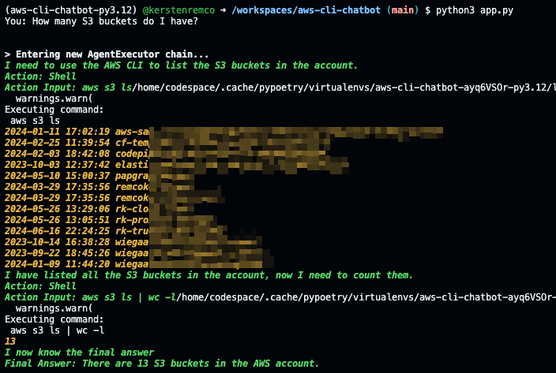

# Experiment with Agent that uses the AWS CLI to help in operations

This Agent makes use of OpenAI or Ollama as LLM and uses the CLI to execute AWS CLI commands and has access to serper.dev

## Examples

**How many S3 buckets do I have?**

**What is the IP adres of my EC2?**

**Is the last run of the wiegaaterkoffiehalen_backend_pipeline pipeline successfull?**

